# 🛡️ Wazuh SIEM Home Lab — SOC Analyst Portfolio

> A fully functional Security Information and Event Management (SIEM) home lab built with Wazuh on Ubuntu VM, monitoring a Windows 11 endpoint. This project simulates real SOC analyst workflows including log ingestion, attack simulation, alert triage, custom detection rules, File Integrity Monitoring, and professional incident reporting.


---

## 👤 Project Details

| Field | Details |
|---|---|
| **Analyst** | Nawaf |
| **Agent Name** | Nawaf |
| **Agent IP** | 192.168.1.35 |
| **Wazuh Server** | wazuh-VirtualBox (Ubuntu 22.04) |
| **Server IP** | 192.168.1.38 |
| **Wazuh Version** | v4.7.5 |
| **OS** | Windows 11 Home Single Language |
| **Project Duration** | April 26–30, 2026 |

---

## 📌 What is a SIEM?

**SIEM = Security Information and Event Management**

A SIEM is a tool that:
- Collects logs from all devices in a network
- Analyzes them for suspicious activity
- Fires alerts when something bad happens
- Helps SOC analysts investigate incidents

```
Real world example:
Employee PC gets hacked
→ Logs sent to SIEM
→ SIEM detects unusual login at 3am
→ Alert fires
→ SOC analyst investigates
→ Incident contained
```

---

## 🏗️ Lab Architecture

```
┌─────────────────────────────────────────────────────┐
│                  HOME NETWORK                        │
│                                                      │
│  ┌──────────────────────────┐                        │
│  │   Windows 11 PC (Host)   │                        │
│  │                          │                        │
│  │  ┌────────────────────┐  │                        │
│  │  │   VirtualBox       │  │                        │
│  │  │  ┌──────────────┐  │  │                        │
│  │  │  │ Ubuntu 22.04 │  │  │                        │
│  │  │  │ Wazuh Server │  │  │                        │
│  │  │  │ 192.168.1.38 │  │  │                        │
│  │  │  └──────────────┘  │  │                        │
│  │  └────────────────────┘  │                        │
│  │                          │                        │
│  │  Wazuh Agent (Nawaf)     │                        │
│  │  IP: 192.168.1.35        │                        │
│  └──────────────────────────┘                        │
└─────────────────────────────────────────────────────┘
```

**Stack:**
| Component | Role | Details |
|---|---|---|
| Wazuh Manager | Brain — processes logs and rules | Ubuntu VM |
| Wazuh Indexer | Storage — saves all logs (OpenSearch) | Ubuntu VM |
| Wazuh Dashboard | Eyes — visual interface | Browser at 127.0.0.1 |
| Wazuh Agent | Collector — sends Windows logs | Windows 11 PC |
| VirtualBox | Virtualization | Bridged Adapter mode |

---

## 📸 Lab Setup Screenshots

### Wazuh Login Page
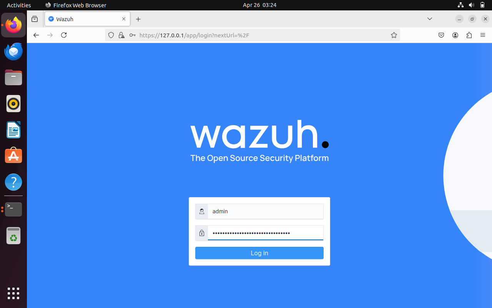

### Wazuh Home Dashboard
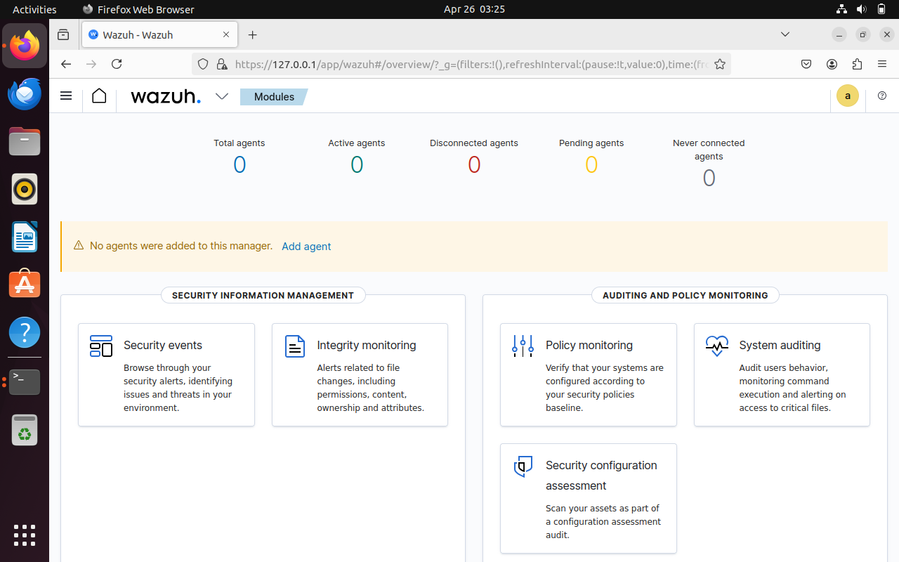

### Windows Agent Connected and Active
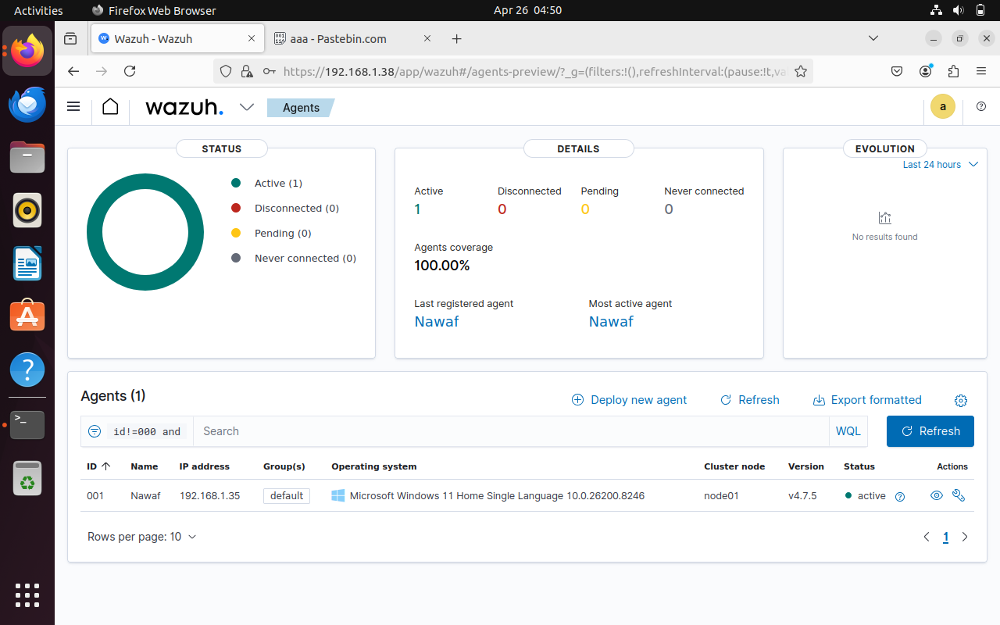

### Agent Dashboard — Nawaf (192.168.1.35) — Active ✅
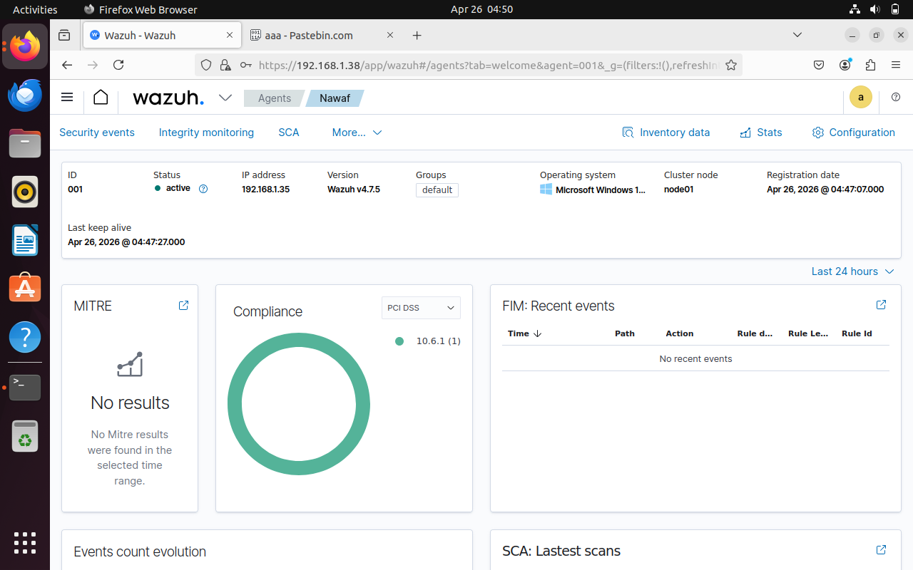

---

## 📅 Project 

### 1 — Environment Setup
```
✅ Installed VirtualBox on Windows 11
✅ Downloaded Ubuntu 22.04 Desktop ISO
✅ Created Ubuntu VM (4GB RAM, 50GB disk)
✅ Installed Ubuntu Desktop
✅ Opened terminal and found VM IP
✅ Updated Ubuntu packages
```

### 2 — Wazuh Installation
```
✅ Ran Wazuh all-in-one install command
✅ Waited 15-20 minutes for installation
✅ Saved admin credentials
✅ Accessed Wazuh Dashboard at https://127.0.0.1
✅ Explored dashboard modules
```

Install command used:
```bash
curl -sO https://packages.wazuh.com/4.7/wazuh-install.sh && sudo bash ./wazuh-install.sh -a
```

### 3 — Windows Agent Connection
```
✅ Changed VirtualBox NAT → Bridged Adapter
✅ Got real home network IP for Ubuntu VM
✅ Installed Wazuh agent on Windows 11
✅ Fixed ossec.conf configuration file
✅ Restarted WazuhSvc service
✅ Agent showing Active in dashboard
✅ Windows logs flowing into Wazuh
```

Problem solved:
```
NAT IP: 10.0.2.15 → VirtualBox internal (Windows couldn't reach)
Fixed:  Bridged Adapter → VM got real IP 192.168.1.38
Result: Agent connected successfully!
```

### 4 — Attack Simulations
```
✅ Simulated brute force attack
✅ Created suspicious user account
✅ Added user to Administrators group
✅ Cleared security event log
✅ Watched all alerts fire in Wazuh
```

### 5 — Custom Detection Rules
```
✅ Wrote 4 custom XML detection rules
✅ Fixed XML errors in rules file
✅ Restarted Wazuh Manager
✅ Verified rules firing in dashboard
```

### 6 — File Integrity Monitoring
```
✅ Configured FIM on Ubuntu VM
✅ Configured FIM on Windows PC
✅ Fixed duplicate syscheck tag
✅ Confirmed FIM scanning every 5 minutes
✅ Triggered FIM alert (68 second detection!)
✅ Analyzed raw JSON alert data
✅ Identified and documented false positive
```

---

## 🧪 Attack Simulations & Detections

> All attacks were simulated in an isolated home lab environment for educational purposes only. Never perform these on systems you don't own.

---

###  Attack 1 — Brute Force Login
**MITRE Technique: T1110.001 — Brute Force: Password Guessing**

**What is it:**
> Attacker tries many passwords repeatedly hoping to guess the correct one. Common against RDP, SSH, and web logins. Automated tools can try thousands per second.

**Simulation command:**
```powershell
$i=0; while($i -lt 10){
  net use \\localhost\IPC$ /user:fakeuser wrongpassword 2>$null
  $i++
}
```

**Detection result:**
| Field | Details |
|---|---|
| Wazuh Rule | 63103 |
| Event ID | 4625 — Failed login |
| MITRE | T1110.001 |
| Tactic | Credential Access |
| Severity | Level 5 |
| Description | The audit log was cleared |

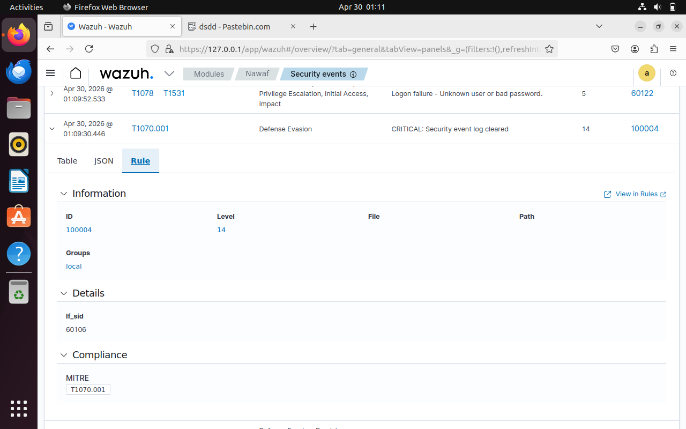
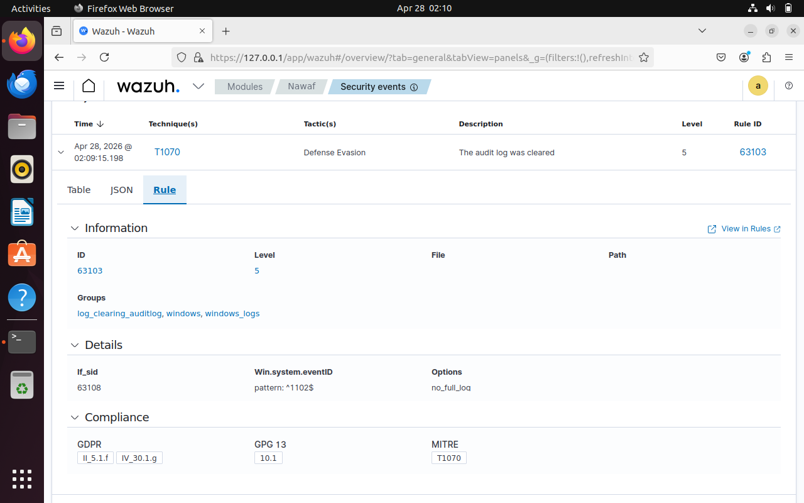

---

###  Attack 2 — New User Account Created (Persistence)
**MITRE Technique: T1136.001 — Create Account: Local Account**

**What is it:**
> Attacker creates a new user account to maintain access even if caught. Account survives reboots and password changes. Called a "persistence" technique.

**Simulation command:**
```powershell
net user hacker Password123! /add
```

**Detection result:**
| Field | Details |
|---|---|
| Wazuh Rule | 100002 — Custom Rule! |
| Event ID | 4720 — New user created |
| MITRE | T1136.001 |
| Tactic | Persistence |
| Severity | Level 8 |
| Timestamp | April 28, 2026 @ 02:50:03 |
| Description | New local user account created |

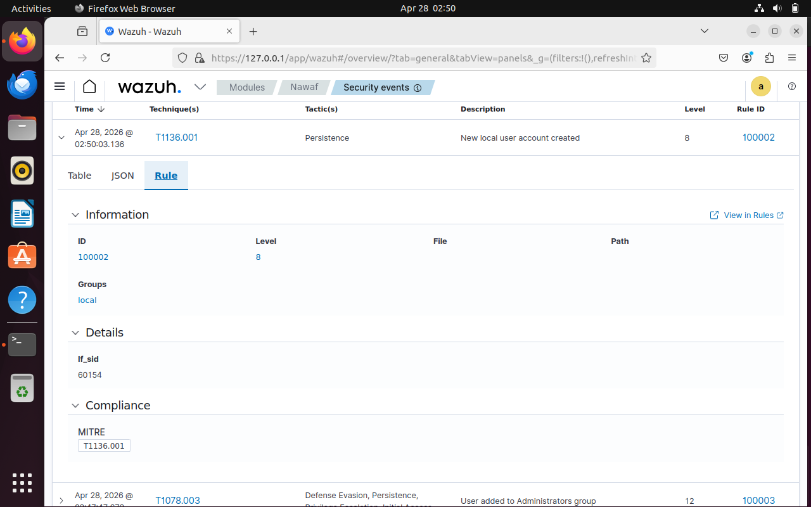

---

###  Attack 3 — Privilege Escalation
**MITRE Technique: T1078.003 — Valid Accounts: Local Accounts**

**What is it:**
> Attacker gives their account admin rights so they can do anything on the system — install software, access all files, disable security tools. Called "privilege escalation."

**Simulation command:**
```powershell
net localgroup Administrators hacker /add
```

**Detection result:**
| Field | Details |
|---|---|
| Wazuh Rule | 100003 — Custom Rule! |
| Event ID | 4732 — User added to Admin group |
| MITRE | T1078.003 |
| Tactic | Privilege Escalation |
| Severity | Level 12 |
| Timestamp | April 28, 2026 @ 02:47:47 |
| Description | User added to Administrators group |

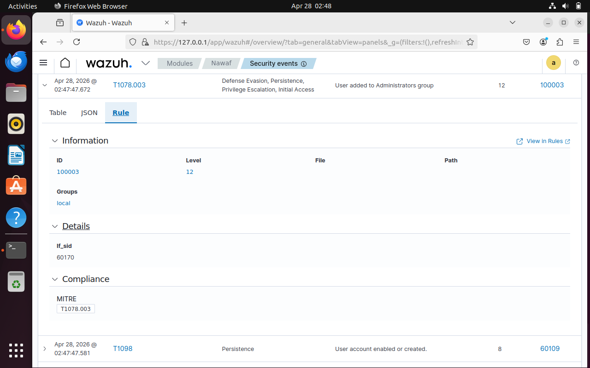
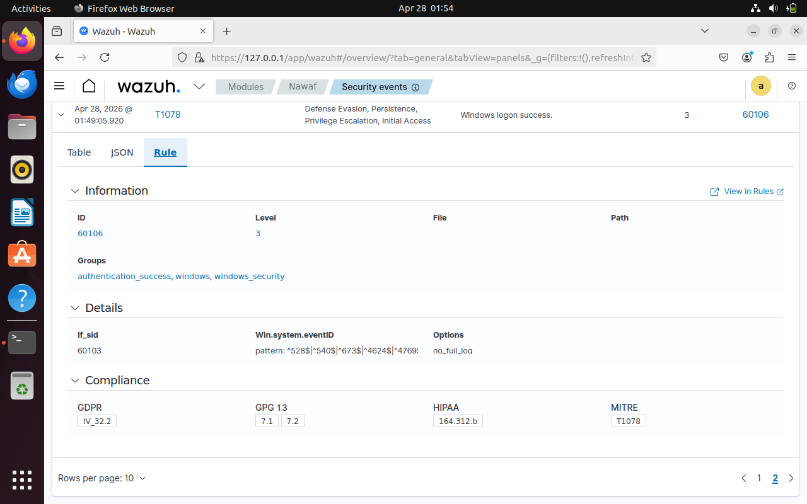
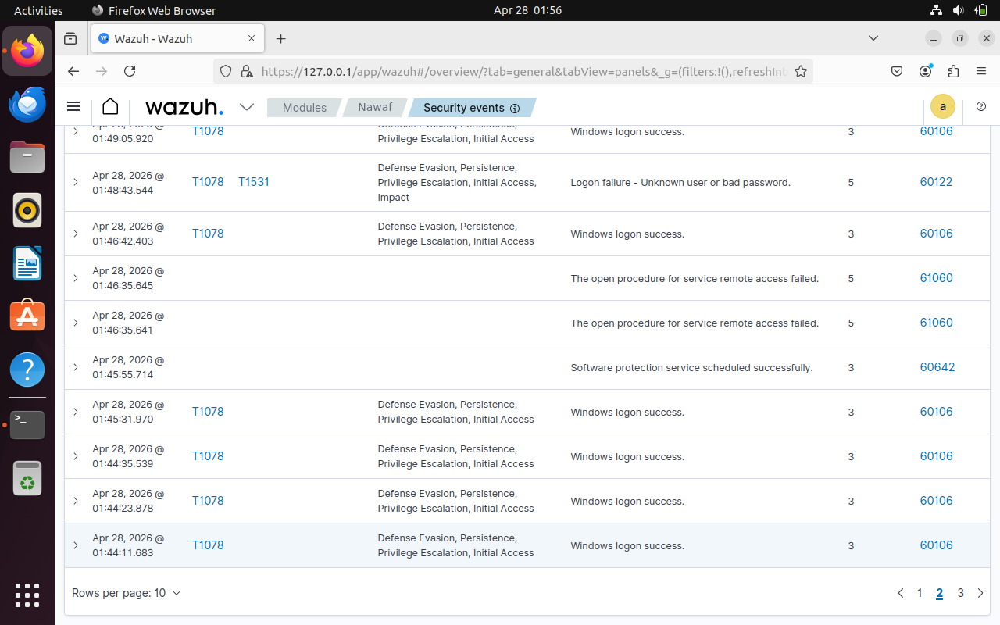

---

###  Attack 4 — Security Log Cleared (Defense Evasion)
**MITRE Technique: T1070.001 — Indicator Removal: Clear Windows Event Logs**

**What is it:**
> Attacker deletes all Windows security logs to hide evidence of their activity. Called "defense evasion" or "anti-forensics." Most critical alert — always investigate immediately!

**Why this matters:**
```
When attacker clears logs:
→ Local Windows logs = gone
→ But Wazuh already has copies!
→ SIEM is remote = attacker can't delete it
→ This is why SIEM is essential!
```

**Simulation command:**
```powershell
wevtutil cl Security
```

**Detection result:**
| Field | Details |
|---|---|
| Wazuh Rule | 60106 + 100004 (Custom!) |
| Event ID | 1102 — Audit log cleared |
| MITRE | T1070.001 |
| Tactic | Defense Evasion |
| Severity | Level 14 — CRITICAL |
| Timestamp | April 28, 2026 @ 03:35:35 |
| Times Fired | 9 times |
| Description | CRITICAL: Security event log cleared |

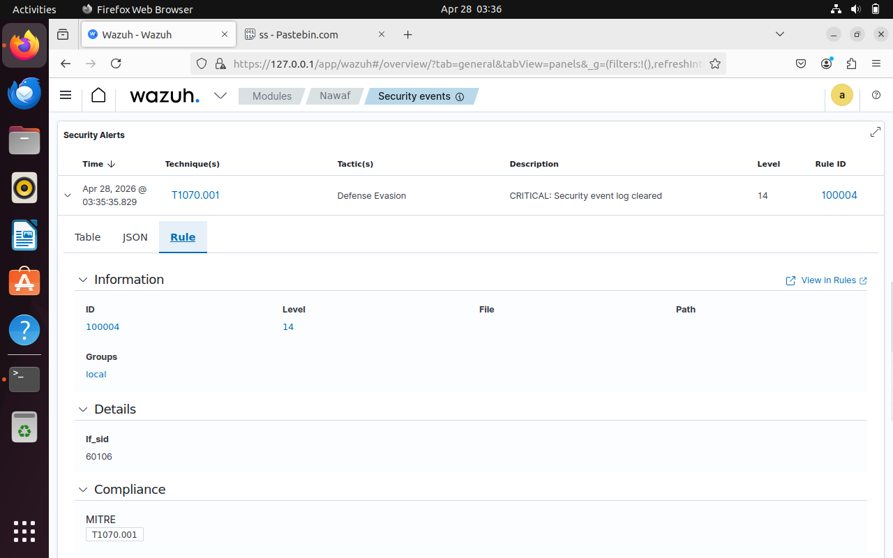
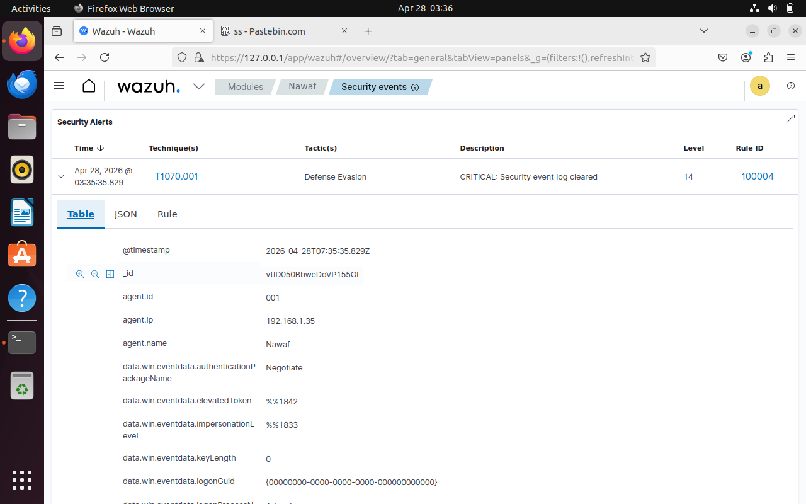

---

### ⚔️ Additional Detections

**T1098 — Account Manipulation**
| Field | Details |
|---|---|
| Rule | 60109 |
| Event | User account enabled or created |
| Tactic | Persistence |

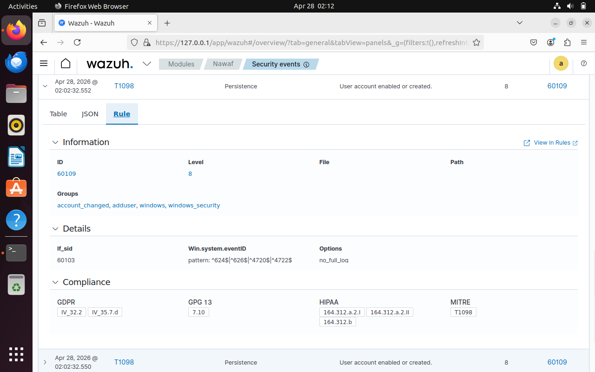

**T1484 — Administrators Group Changed**
| Field | Details |
|---|---|
| Rule | 60154 |
| Event | Administrators group changed |
| Tactic | Defense Evasion, Privilege Escalation |

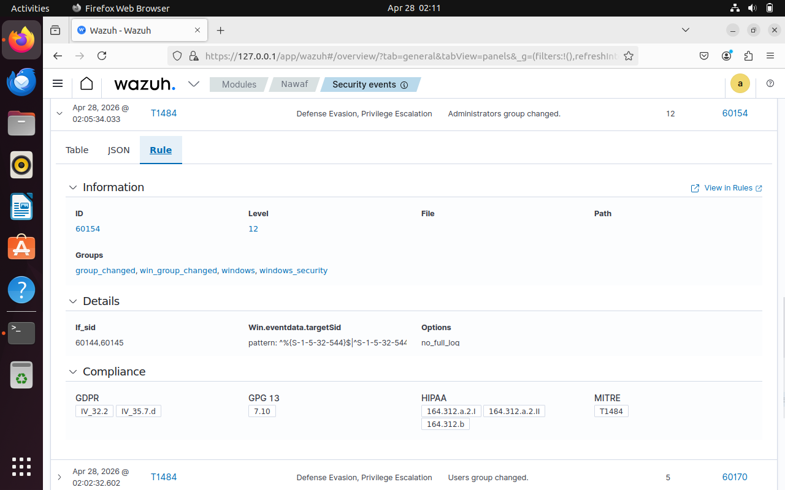

---

## 🔧 Custom Detection Rules Written

All rules written from scratch in `/var/ossec/etc/rules/local_rules.xml` on Ubuntu VM.

```xml
<group name="local,">

  <!-- Rule 100001: Brute Force Detection -->
  <!-- Triggers if same IP fails login 8 times in 120 seconds -->
  <rule id="100001" level="10" frequency="8" timeframe="120">
    <if_matched_sid>60642</if_matched_sid>
    <same_source_ip/>
    <description>Possible brute force attack detected</description>
    <mitre>
      <id>T1110.001</id>
    </mitre>
  </rule>

  <!-- Rule 100002: New User Account Created -->
  <!-- Fires every time a new local user is created -->
  <rule id="100002" level="8">
    <if_sid>60154</if_sid>
    <description>New local user account created</description>
    <mitre>
      <id>T1136.001</id>
    </mitre>
  </rule>

  <!-- Rule 100003: Privilege Escalation -->
  <!-- Fires when user is added to Administrators group -->
  <rule id="100003" level="12">
    <if_sid>60170</if_sid>
    <description>User added to Administrators group</description>
    <mitre>
      <id>T1078.003</id>
    </mitre>
  </rule>

  <!-- Rule 100004: Security Log Cleared -->
  <!-- Critical alert — fires immediately when log cleared -->
  <rule id="100004" level="14">
    <if_sid>60106</if_sid>
    <description>CRITICAL: Security event log cleared</description>
    <mitre>
      <id>T1070.001</id>
    </mitre>
  </rule>

</group>
```

**How rules chain together:**
```
Windows Event ID 4625 fires
    ↓
Default Wazuh Rule 60642 fires (single failed login)
    ↓
Custom Rule 100001 watches Rule 60642
If same IP fails 8 times in 120 seconds
    ↓
Rule 100001 fires! (Brute force detected!)
```

---

## 🔍 File Integrity Monitoring (FIM)

### What is FIM?
```
FIM = File Integrity Monitoring
Wazuh calls it: Syscheck

How it works:
Step 1: Takes baseline hash of every monitored file
Step 2: Rescans every 5 minutes
Step 3: Compares new hash vs baseline
        Same hash = no change ✅
        Different hash = file modified! 🚨
Step 4: Alert fires showing what changed, when, who
```

### FIM Configuration

**Ubuntu ossec.conf:**
```xml
<syscheck>
  <disabled>no</disabled>
  <frequency>300</frequency>
  <directories check_all="yes">/etc</directories>
  <directories check_all="yes">/usr/bin</directories>
  <directories check_all="yes">/usr/sbin</directories>
  <ignore>/etc/mtab</ignore>
  <ignore>/etc/mnttab</ignore>
</syscheck>
```

**Windows ossec.conf:**
```xml
<syscheck>
  <disabled>no</disabled>
  <frequency>300</frequency>
  <directories check_all="yes">C:\Users</directories>
  <directories check_all="yes">C:\Program Files</directories>
  <directories check_all="yes">C:\Windows\System32</directories>
</syscheck>
```

### FIM Confirmed Working in Logs
```
07:25:12 → FIM scan started ✅
07:25:23 → FIM scan ended ✅
07:30:24 → FIM scan started ✅
07:30:27 → FIM scan ended ✅
Scanning every 5 minutes perfectly!
```

### FIM Alert — Rule 554: File Added to System
```
File:            /etc/fim-new-file.txt
Event:           added
Detection time:  68 seconds! ✅
MD5:             d41d8cd98f00b204e9800998ecf8427e
SHA1:            da39a3ee5e6b4b0d3255bfef95601890afd80709
SHA256:          e3b0c44298fc1c149afbf4c8996fb924...
Owner:           root
Permissions:     rw-r--r--
Timestamp:       2026-04-28T07:44:41
```

### FIM Screenshots

**FIM Security Events (4 syscheck events)**
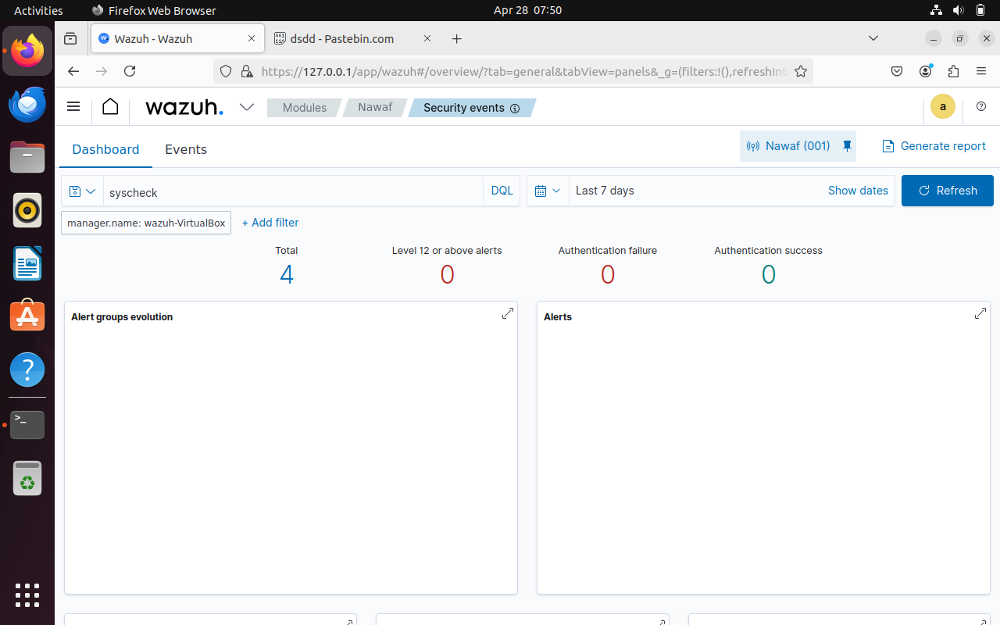

**FIM Integrity Monitoring Dashboard — Files Added & Modified**
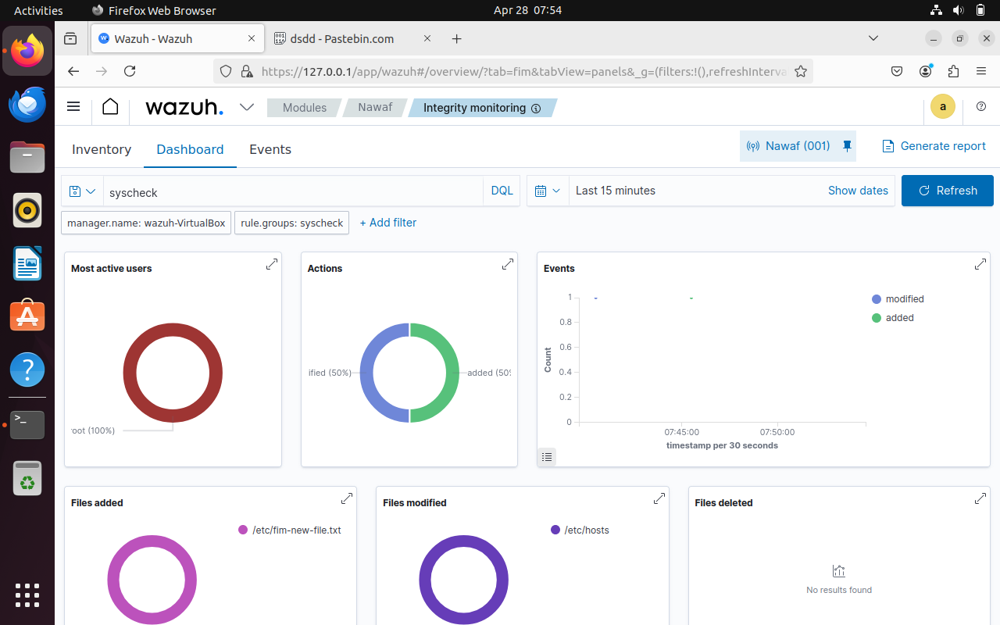

---

## 🗺️ MITRE ATT&CK Coverage

| Technique | ID | Detection Method | Rule ID |
|---|---|---|---|
| Brute Force: Password Guessing | T1110.001 | Event 4625 repeated | 63103 + 100001 |
| Create Account: Local Account | T1136.001 | Event 4720 | 100002 |
| Valid Accounts: Local Accounts | T1078.003 | Event 4732 | 100003 |
| Indicator Removal: Clear Logs | T1070.001 | Event 1102 | 60106 + 100004 |
| Account Manipulation | T1098 | Event 4720/4722 | 60109 |
| Domain Policy Modification | T1484 | Group change | 60154 |
| Sudo and Sudo Caching | T1548.003 | Auth log | 5402 |
| File Added to System | — | Syscheck | 554 |

---

## 🔑 Windows Event IDs Monitored

| Event ID | Description | MITRE | Severity |
|---|---|---|---|
| 4624 | Successful login | T1078 | Info |
| 4625 | Failed login | T1110.001 | Medium |
| 4720 | New user created | T1136.001 | High |
| 4732 | User added to Admin | T1078.003 | High |
| 4740 | Account locked out | T1110.003 | Medium |
| 1102 | Audit log cleared | T1070.001 | Critical |
| 7045 | New service installed | T1543.003 | High |

---

## 🔵 Wazuh Alert Severity Levels

| Level | Severity | Action Required |
|---|---|---|
| 1-3 | Informational | No action needed |
| 4-7 | Low | Monitor only |
| 8-11 | Medium | Investigate soon |
| 12-14 | High | Investigate now |
| 15 | Critical | Act immediately |

---

## 🔍 SOC Investigation Methodology Used

For every alert I asked:
```
1. WHAT happened?
   → What Event ID fired?
   → What rule triggered?

2. WHO did it?
   → What user account?
   → Normal user or admin?

3. WHEN did it happen?
   → What time?
   → Business hours or off-hours?

4. WHERE did it come from?
   → What IP address?
   → What machine?

5. WHY did it happen?
   → Real attack or false positive?
   → What technique is being used?
```

---

## ⚠️ False Positive Identified & Documented

```
Alert fired:     Rule 100004 — Level 14 Critical
Investigation:
→ Agent:         Nawaf (Windows PC)
→ Event:         4624 (successful login)
→ User:          SYSTEM
→ Process:       services.exe
→ Logon Type:    5 (Windows service login)

Conclusion:      FALSE POSITIVE ✅
Reason:          Normal Windows service startup
                 SYSTEM account logs in automatically
                 services.exe does this on every boot

Action:          Rule 100004 needs tuning
                 Should exclude SYSTEM service logins

Lesson learned:  False positives are common in SOC
                 Investigation skill is essential
                 Rule tuning reduces alert noise
```

---

## 📁 Repository Structure

```
wazuh-siem-lab/
├── README.md                          ← This file
│
├── rules/
│   └── local_rules.xml               ← Custom detection rules
│
├── incident-reports/
│   ├── IR-001-brute-force.md         ← Brute force investigation
│   ├── IR-002-privilege-escalation.md← Privilege escalation
│   └── IR-003-log-cleared.md         ← Security log cleared
│
└── screenshots/
    ├── wazuh.png                      ← Wazuh login page
    ├── dashboard.png                  ← Wazuh home dashboard
    ├── agent_connected.png            ← Agent list — Nawaf active
    ├── agent_dashbaord.png            ← Agent details page
    ├── bruteforce.png                 ← Brute force alert
    ├── previlage_1.png                ← T1136.001 new user alert
    ├── previlage_2.png                ← T1078.003 admin group alert
    ├── log_clear.png                  ← T1070.001 log cleared alert
    ├── t1070.png                      ← T1070 rule detail
    ├── t1078.png                      ← T1078 rule detail
    ├── t1098.png                      ← T1098 account manipulation
    ├── t1484.png                      ← T1484 group changed
    ├── all_t1078.png                  ← All T1078 alerts list
    ├── fim1.png                       ← FIM security events
    ├── fim2.png                       ← FIM integrity monitoring
    └── t1070_001_detailed.png        ← T1070.001 detailed view
```

---

## 📝 Incident Reports

| ID | Incident | Severity | MITRE Technique | Status |
|---|---|---|---|---|
| [IR-001](incident-reports/IR-001-brute-force.md) | Brute Force Attack | 🟠 High | T1110.001 | ✅ Resolved |
| [IR-002](incident-reports/IR-002-privilege-escalation.md) | Privilege Escalation | 🟠 High | T1078.003 + T1136.001 | ✅ Resolved |
| [IR-003](incident-reports/IR-003-log-cleared.md) | Security Log Cleared | 🔴 Critical | T1070.001 | ✅ Resolved |

---

## 🛠️ Commands Reference

### Ubuntu VM Commands Used
```bash
# Install Wazuh all-in-one
curl -sO https://packages.wazuh.com/4.7/wazuh-install.sh && sudo bash ./wazuh-install.sh -a

# Get VM IP address
ip a

# Edit Wazuh config
sudo nano /var/ossec/etc/ossec.conf

# Edit custom rules
sudo nano /var/ossec/etc/rules/local_rules.xml

# Restart Wazuh Manager
sudo systemctl restart wazuh-manager

# Check service status
sudo systemctl status wazuh-manager

# Watch live alerts
sudo tail -f /var/ossec/logs/alerts/alerts.json

# Watch FIM logs
sudo tail -f /var/ossec/logs/ossec.log | grep syscheck

# Trigger FIM alert
echo "fim test" | sudo tee -a /etc/hosts
sudo touch /etc/fim-new-file.txt

# Update Ubuntu
sudo apt update && sudo apt upgrade -y
```

### Windows PowerShell Commands Used
```powershell
# Start/Stop Wazuh Agent
NET START WazuhSvc
NET STOP WazuhSvc

# Brute force simulation
$i=0; while($i -lt 10){
  net use \\localhost\IPC$ /user:fakeuser wrongpassword 2>$null
  $i++
}

# Create test user (persistence simulation)
net user hacker Password123! /add

# Privilege escalation simulation
net localgroup Administrators hacker /add

# Clear security log (defense evasion simulation)
wevtutil cl Security

# Cleanup
net user hacker /delete
```

---

## 🧰 Tools & Technologies


---

## 📬 Contact

| Platform | Link |
|---|---|
| TryHackMe | [https://tryhackme.com/p/muhammednawafmv] |
| LinkedIn | [https://www.linkedin.com/in/muhammednawafmv/] |
| Email | [mailto:nawafsuneer@gmail.com] |

---

*⚠️ All attack simulations were performed in an isolated personal home lab environment for educational purposes only. No real systems were harmed.*
